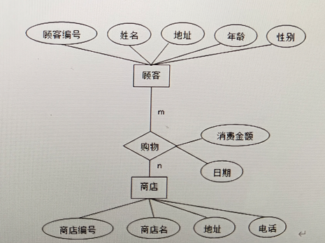

# MySQL 期末复习资料

---

## 一、选择题（第1-40题）

### 数据库基础概念

**1. 数据库管理系统（DBMS）属于（）**
A. 应用软件 B. 操作系统 C. 系统软件 D. 支撑硬件
> 答案：C

**2. 决定数据库整体结构与数据组织方式的核心是（）**
A. 数据库文件 B. 数据模型 C. 数据库应用软件 D. 数据库管理员
> 答案：B
>
> 数据模型是对现实世界数据特征的抽象，用来描述数据结构、数据联系、数据语义及完整性约束，是数据库设计的核心基础。
> 数据模型的三个层次：概念、逻辑、物理

**3. 层次模型的数据结构是（）**
A. 二维表 B. 网状结构 C. 树形结构 D. 链表
> 答案：C

**4. 信息世界最常用的概念模型是（）**
A. 层次模型 B. E-R 模型 C. 关系模型 D. 网状模型
> 答案：B
>
> 关键点：概念模型 ≠ 逻辑模型，二者阶段不一样。

### 关系代数与数据库基础

**5. 关系代数中，水平筛选元组的操作是（）**
A. 投影 B. 选择 C. 笛卡尔积 D. 连接
> 答案：B

**6. 关系代数中，从列抽取属性的操作是（）**
A. 投影 B. 交集 C. 选择 D. 差集
> 答案：A

**7. 两个关系取共同元组的运算是（）**
A. 并集 B. 交集 C. 差集 D. 除法
> 答案：B

**8. 自然连接会（）**
A. 只选 B. 分组统计 C. 匹配同名列 + 合并列 D. 只选
> 答案：C
>
> 自然连接：自动找两张表同名且同类型的列，做等值匹配，然后合并两表的所有列，去掉重复列。

**9. 唯一标识元组且不能为空的是（）**
A. 外键 B. 候选码 C. 主键 D. 超码
> 答案：C

**10. 能唯一标识元组的最小属性集是（）**
A. 超码 B. 主键 C. 候选码 D. 外键
> 答案：C

### DDL 与 DML

**11. 属于 DML 的语句是（）**
A. CREATE B. DROP C. ALTER D. SELECT
> 答案：D

**12. 不属于 DDL 的是（）**
A. CREATE TABLE B. DELETE C. ALTER TABLE D. DROP TABLE
> 答案：B

#### DDL（数据定义语言）
- 作用：定义/修改/删除数据库、表、视图、索引等「结构」，不碰数据内容。
- `CREATE`：创建（库、表、视图）
- `ALTER`：修改（表结构、字段）
- `DROP`：删除（库、表、视图）
- `TRUNCATE`：清空表（删数据、保留结构，属 DDL）

#### DML（数据操纵语言）
- 作用：增删改查「表里的数据内容」，不碰结构。
- `INSERT`：插入数据
- `DELETE`：删除数据
- `UPDATE`：更新数据
- `SELECT`：查询数据

### SQL 基础

**13. SQL 中列别名关键字是（）**
> 答案：AS

**14. MySQL 查看当前库所有表命令是（）**
A. use B. desc C. show databases D. show tables
> 答案：D

**15. MySQL 退出客户端命令是（）**
A. exit B. close C. use quit D. logout
> 答案：A

**16. 模糊查询匹配任意多字符是（）**
A. # B. _ C. % D. *
> 答案：C
>
> `#`、`*` 不是 SQL 标准模糊通配符。`_` 匹配单个字符，`%` 匹配任意多字符。

### 条件查询

**17. 查询"女生成绩不及格"的正确条件是（）**
A. 性别='女' OR 成绩>=60 B. 性别='男' AND 成绩>=60
C. 性别='女' AND 成绩<60 D. 性别='女' OR 成绩<60
> 答案：C

### 索引

**18. 关于索引正确的是（）**
A. 索引越多越快 B. 索引降低增删改效率
C. 索引只能建字符型 D. 聚集索引可建多个
> 答案：B
>
> - 索引会占用空间、维护开销大，过多反而拖慢写入。
> - 增删改时要同步更新所有索引，开销变大。
> - 数值、日期、字符串都能建索引。
> - 一张表只能有 1 个聚集索引（物理排序）。

**19. 不适合建索引的字段是（）**
A. 常用查询字段 B. 取值重复度极高
C. 主键字段 D. 大数据量表字段
> 答案：B

### 范式（NF）

**20. 1NF 的要求是（）**
A. 消除传递依赖 B. 消除部分依赖 C. 列不可再分 D. 主属性无依赖
> 答案：C

**21. 2NF 的要求是（）**
A. 列不可再分 B. 消除非主属性对主键部分依赖
C. 消除传递依赖 D. 消除主属性依赖
> 答案：B

**22. 不属于函数依赖的是（）**
A. 完全依赖 B. 部分依赖 C. 传递依赖 D. 离散依赖
> 答案：D

**23. 满足 3NF 一定满足（）**
A. 仅 1NF B. 1NF、2NF C. BCNF D. 都不满足
> 答案：B

### 事务（ACID）

**24. 事务 ACID 中 I 是（）**
A. 原子性 B. 隔离性 C. 一致性 D. 持久性
> 答案：B

#### ACID 四个特性（必考）
- **A（Atomicity）原子性**：事务要么全成、要么全败，不可拆分。
- **C（Consistency）一致性**：执行前后，数据库数据状态始终合法。
- **I（Isolation）隔离性**：并发事务互相隔离、互不干扰。
- **D（Durability）持久性**：提交成功后，结果永久保存、不丢失。

### 事务隔离级别

**25. 事务隔离级别最低的是（）**
A. 读未提交 B. 读已提交 C. 可重复读 D. 串行化
> 答案：A

#### 隔离级别从低到高
1. **读未提交**（最低）：能读到别人没提交的数据，会脏读、不可重复读、幻读。
2. **读已提交**：只能读已提交数据，解决脏读。
3. **可重复读**（MySQL 默认）：解决脏读、不可重复读。
4. **串行化**（最高）：完全隔离，解决三类问题，但最慢。

### 并发问题与死锁

**26. 读到未提交数据称为（）**
A. 幻读 B. 脏读 C. 不可重复读 D. 死锁
> 答案：B

**27. 两事务互相无限等待叫（）**
A. 活锁 B. 死锁 C. 互斥锁 D. 共享锁
> 答案：B

### 死锁四个必要条件

**28. 死锁必要条件不包括（）**
A. 互斥 B. 请求保持 C. 不剥夺 D. 共享
> 答案：D

- **互斥**：资源一次只能被一个事务占用
- **请求保持**：已占资源不释放，还申请新资源
- **不剥夺**：资源只能主动释放，不能被强行夺走
- **环路等待**：形成循环等待链

### 存储过程与触发器

**29. 存储过程优势是（）**
A. 语法简单 B. 一次编译多次执行
C. 只能查询 D. 必须带参数
> 答案：B

**30. 触发器正确说法是（）**
A. 仅插入触发 B. 需手动调用 C. 增删改自动触发 D. 不能读新旧数据
> 答案：C

### 权限管理

**31. 分配权限关键字是（）**
A. EVOKE B.GRANTR  C. CREAT D. ALTER
> 答案：B

**32. 收回权限关键字是（）**
A. GRANT B. REVOKE C. DROP D. MODIFY
> 答案：B

### 完整性约束

**33. 外键维护的完整性是（）**
A. 实体完整性 B. 参照完整性 C. 用户自定义完整性 D. 事务完整性
> 答案：B

**34. 限制字段取值范围属于（）**
A. 实体完整性 B. 参照完整性 C. 用户自定义完整性 D. 安全完整性
> 答案：C

### 三级模式

**35. 视图对应三级模式中的（）**
A. 外模式 B. 概念模式 C. 内模式 D. 存储模式
> 答案：A

#### 三级模式
- **外模式**（用户级）：面向用户，是视图、用户看到的表。
- **概念模式**（全局逻辑级）：面向整个数据库，是基本表、全局逻辑结构。
- **内模式**（物理级）：面向磁盘，是存储文件、索引、物理结构。
- 一句话：视图 = 外模式，基本表 = 概念模式，存储文件 = 内模式。

### 视图与备份

**36. 视图特点是（）**
A. 存真实数据 B. 独立表 C. 虚拟表、仅存定义 D. 一定可更新
> 答案：C

**37. 只备份变化数据是（）**
A. 完整备份 B. 增量备份 C. 全量备份 D. 冷备份
> 答案：B

#### 备份类型区分
- **完整备份 / 全量备份**：备份所有数据（全部）
- **增量备份**：只备份上次备份后新增/变化的数据（只变的）
- **冷备份**：数据库停止运行时做的备份（方式，不是范围）

**38. MySQL 整库备份工具是（）**
A. mysqladmin B. mysqldump C. mysqlshow D. mysqlimport
> 答案：B

**39. 权限打包对象是（）**
A. 用户 B. 角色 C. 视图 D. 存储过程
> 答案：B

### 分组与筛选

**40. 分组后筛选子句是（）**
A. WHERE B. HAVING C. ORDER BY D. GROUP BY
> 答案：B

---

## 二、填空题（第1-18题）

1. 数据库三级模式中，介于外模式和内模式之间的是 **概念模式（模式）**。
2. 关系代数中，从列抽取属性的操作是 **投影**。
3. 删除表中全部数据但保留表结构的命令是 **DELETE**。
4. 提升查询速度常用手段是 **建立索引**。
5. 事务 ACID 中 I 是 **隔离性**。
6. 两事务互相无限等待称为 **死锁**。
7. 分组统计子句是 **GROUP BY**。
8. 权限打包管理对象是 **角色**。
9. 触发器触发时机：**增、删、修改（更新）**。
10. 全局逻辑到物理存储的映像是 **模式/内模式映像**。
11. 数据控制功能包括：**安全性、完整性、并发控制、故障恢复**。
12. E-R 模型中实体联系类型：**一对一、一对多、多对多**。
13. 能唯一标识元组的最小属性集是 **候选码**。
14. SQL 中删除表结构的关键字是 **DROP**。
15. 分组后条件筛选子句是 **HAVING**。
16. 视图数据来源于 **基本表（基表）**。
17. 3NF 在 2NF 基础上消除 **传递** 函数依赖。
18. 事务四大特性：**原子性、一致性、隔离性、持久性**。

---

## 三、简答题（第1-8题）

### 1. 简述 DBMS 的主要功能
要点：数据定义、数据操纵、数据控制、运行管理、数据库维护。

### 2. 简述主键与外键的含义及作用
- **主键**：唯一标识元组，非空唯一，保证实体完整性。
- **外键**：引用另一表主键，保证参照完整性，维护表间关联。

### 3. 简述视图与基本表的区别与联系
- **联系**：视图基于基本表，数据来自基表。
- **区别**：基表存真实数据，视图是虚拟表，仅存查询定义。

### 4. 简述并发操作的三类不一致问题
要点：脏读、不可重复读、幻读。

### 5. 简述死锁的四个必要条件
要点：互斥、请求与保持、不剥夺、环路等待。

### 6. 简述存储过程的概念及优点
- **概念**：编译后存于服务器的 SQL 集合。
- **优点**：一次编译多次执行、减少网络流量、封装逻辑、安全可控。

### 7. 简述超码与候选码的关系
- 候选码是最小超码；候选码一定是超码，超码不一定是候选码。

### 8. 简述 SQL 语言四大功能分类
- **DDL**（数据定义）：CREATE、ALTER、DROP
- **DML**（数据操纵）：INSERT、DELETE、UPDATE、SELECT
- **DCL**（数据控制）：GRANT、REVOKE
- **TCL**（事务控制）：COMMIT、ROLLBACK

---

## 四、SQL 操作题

### 表结构
- `Student(Sno, Sname, Ssex, Sage, Sdept)`
- `Course(Cno, Cname, Ccredit)`
- `SC(Sno, Cno, Grade)`

### 1. 创建学生表

```sql
CREATE TABLE Student (
    Sno CHAR(10) PRIMARY KEY,
    Sname VARCHAR(20) NOT NULL,
    Ssex CHAR(2),
    Sage INT,
    Sdept VARCHAR(30)
);
```

### 2. 查询年龄 > 20 且非数学系学生

```sql
SELECT Sno, Sname, Sdept
FROM Student
WHERE Sage > 20 AND Sdept <> '数学系';
```

### 3. 查学生姓名、课程名、成绩，按成绩降序

```sql
SELECT s.Sname, c.Cname, sc.Grade
FROM Student s
JOIN SC sc ON s.Sno = sc.Sno
JOIN Course c ON sc.Cno = c.Cno
ORDER BY Grade DESC;
```

### 4. 创建存储过程：根据学号查姓名（示例）

```sql
DELIMITER //
CREATE PROCEDURE GetStuName(IN s_no CHAR(10))
BEGIN
    SELECT Sname FROM Student WHERE Sno = s_no;
END //
DELIMITER ;
```

### 5. 创建触发器示例

```sql
DELIMITER //
CREATE TRIGGER trg_after_insert
AFTER INSERT ON SC
FOR EACH ROW
BEGIN
    -- 触发器逻辑
END //
DELIMITER ;
```

### 6. 查平均分 > 75 的学生及平均分

```sql
SELECT s.Sno, s.Sname, AVG(sc.Grade) AS AvgGrade
FROM Student s
JOIN SC sc ON s.Sno = sc.Sno
GROUP BY s.Sno, s.Sname
HAVING AVG(sc.Grade) > 75;
```

### 7. 创建课程表（主键、学分非空）

```sql
CREATE TABLE Course (
    Cno CHAR(6) PRIMARY KEY,
    Cname VARCHAR(30) NOT NULL,
    Ccredit INT NOT NULL
);
```

### 8. 查询女生的学号、姓名、年龄，按年龄升序

```sql
SELECT Sno, Sname, Sage
FROM Student
WHERE Ssex = '女'
ORDER BY Sage ASC;
```

### 9. 统计每门课程的选课人数、最高分、最低分

```sql
SELECT c.Cno, c.Cname, COUNT(sc.Sno) AS 人数,
       MAX(sc.Grade) AS 最高分, MIN(sc.Grade) AS 最低分
FROM Course c
LEFT JOIN SC sc ON c.Cno = sc.Cno
GROUP BY c.Cno, c.Cname;
```

### 10. 创建视图：显示计算机系学生信息

```sql
CREATE VIEW V_CompStu AS
SELECT Sno, Sname, Sage
FROM Student
WHERE Sdept = '计算机系';
```

---

## 五、设计题

### 1. 设计一个商店销售管理系统，其需求包括以下内容：

（1）存在商店和顾客两个实体，"商店"的属性包括：商店编号、商店名、地址、电话，"顾客"属性有：顾客编号、姓名、地址、年龄、性别。

一个商店可以有多个顾客前来购物，一个顾客可以选择到多个商店购物，此外，顾客每次去商店购物行为包括消费金额和日期。请根据上述需求分析完成以下设计。

---

#### (1) 画出 E-R 图，注明属性和联系的类型。


<p align="center">
  
</p>

> **评分标准：**（上图中）
> - 顾客 E-R图（2分）
> - 商店 E-R图（2分）
> - 购物 E-R图（2分）
> - 标注 m（2分）
> - 标注 n（2分）

---

#### (2) 将 E-R 模型转换成关系模式，要求关系模式主码加下划线表示。

① **顾客**（<u>顾客编号</u>，姓名，地址，年龄，性别）
> - 关系模式（2分）
> - 下划线标注主码（1分）

② **商店**（<u>商店编号</u>，商店名，地址，电话）
> - 关系模式（2分）
> - 下划线标注主码（1分）

③ **购物**（<u>顾客编号</u>，<u>商店编号</u>，日期，消费金额）
> - 关系模式（2分）

---

### 题目2：员工项目关系模式范式分解

#### 原始关系模式
员工项目（员工编号，员工姓名，部门编号，部门名称，项目编号，项目名称，参与工时）

#### (1) 异常分析

- **数据冗余**：同一员工姓名、部门名称重复存储；同一项目名称随项目编号多次重复。
- **插入异常**：新建部门暂无员工，无法录入部门信息；新增项目暂无员工参与，无法录入项目信息。
- **删除异常**：删除某员工的项目参与记录，可能连带删除部门、项目的基础信息，造成数据丢失。
- **更新异常**：修改部门名称或项目名称时，需更新多条重复记录，易出现数据不一致。

#### (2) 分解至 3NF

**函数依赖分析：**
- 员工编号 → 员工姓名、部门编号
- 部门编号 → 部门名称
- 项目编号 → 项目名称
-（员工编号，项目编号）→ 参与工时

**分解为 3NF 关系模式：**

1. **员工**（<u>员工编号</u>，员工姓名，部门编号）
2. **部门**（<u>部门编号</u>，部门名称）
3. **项目**（<u>项目编号</u>，项目名称）
4. **员工参与项目**（<u>员工编号</u>，<u>项目编号</u>，参与工时）
